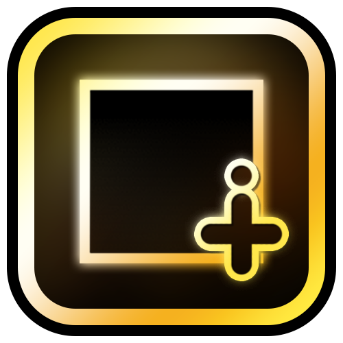

# ObjInfo
The mod were made using Geode SDK and CLion for C++.




## Getting started
I recommend heading over to [the getting started section on Geode docs](https://docs.geode-sdk.org/getting-started/) for useful info on what to do with it.

## Build instructions
For more info, see [Geode docs](https://docs.geode-sdk.org/getting-started/create-mod#build)\n
Just open CMD, PowerShell or your terminal in mod`s directory and run this command:
```sh
# Assuming you have the Geode CLI set up already
geode build
```

# Resources
* [Geode SDK Documentation](https://docs.geode-sdk.org/)
* [Geode SDK Source Code](https://github.com/geode-sdk/geode/)
* [Geode CLI](https://github.com/geode-sdk/cli)
* [Bindings](https://github.com/geode-sdk/bindings/)
* [Dev Tools](https://github.com/geode-sdk/DevTools)
* [CLion by JetBrains](https://www.jetbrains.com/clion/)
